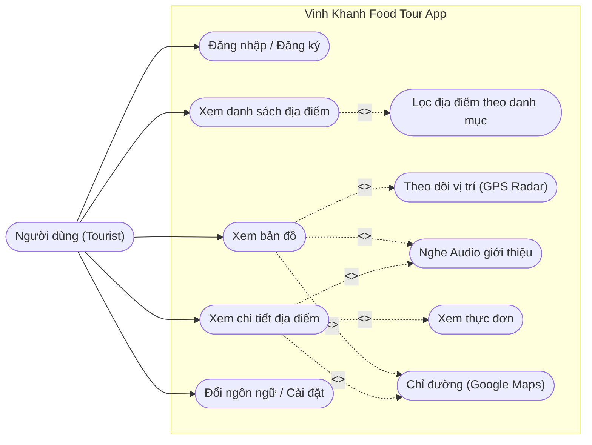
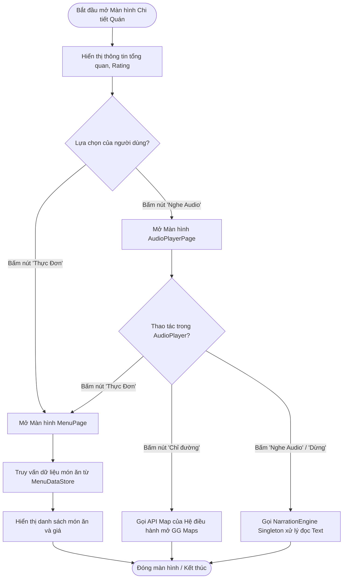
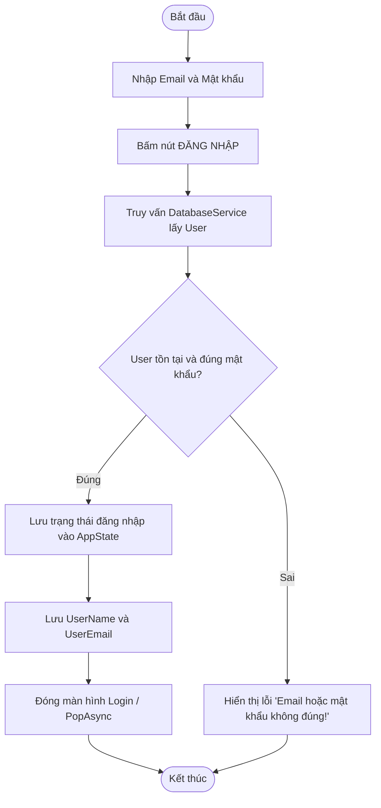
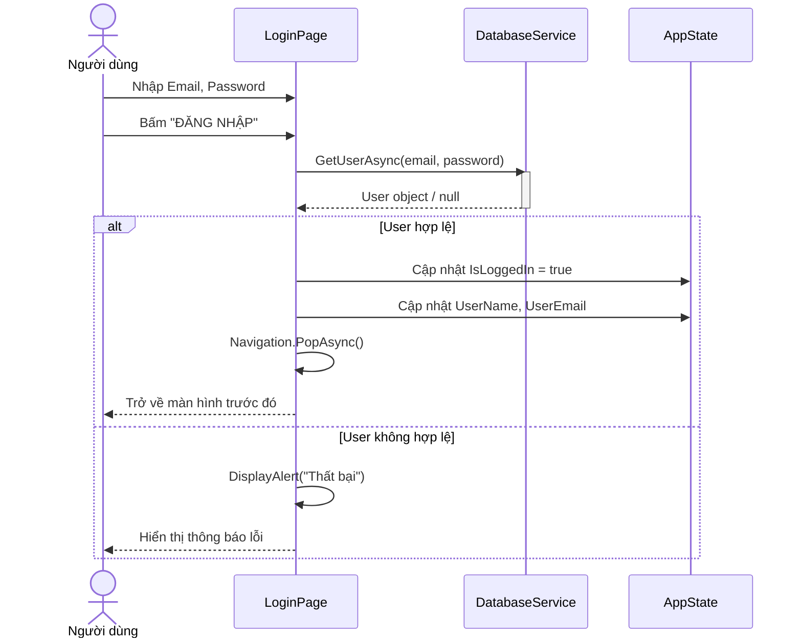
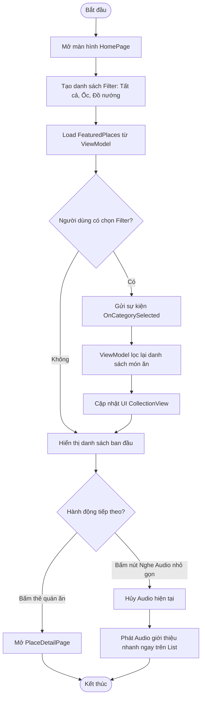
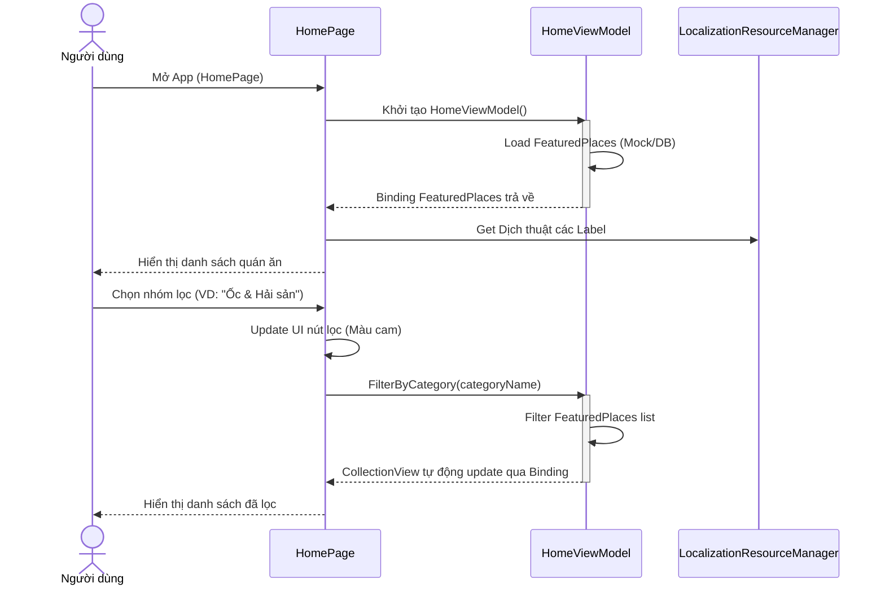
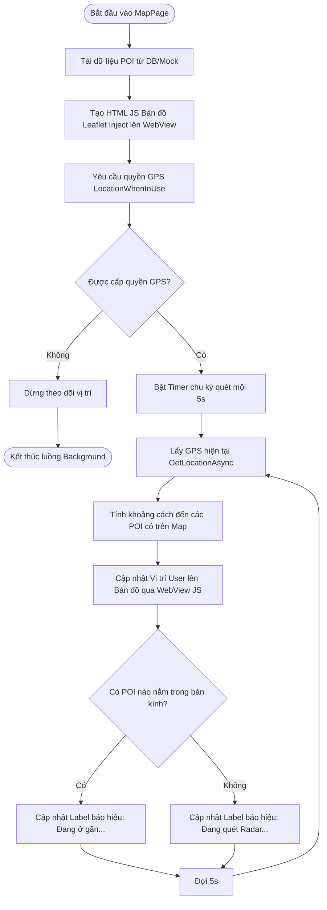
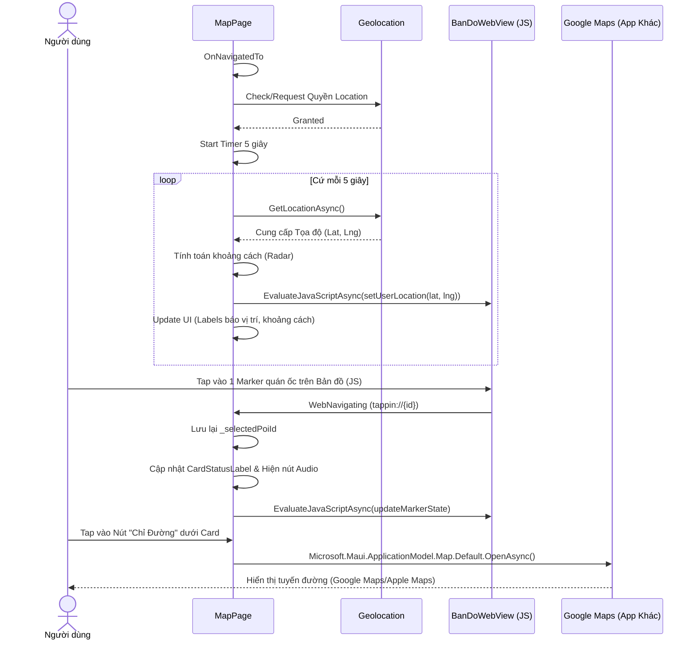
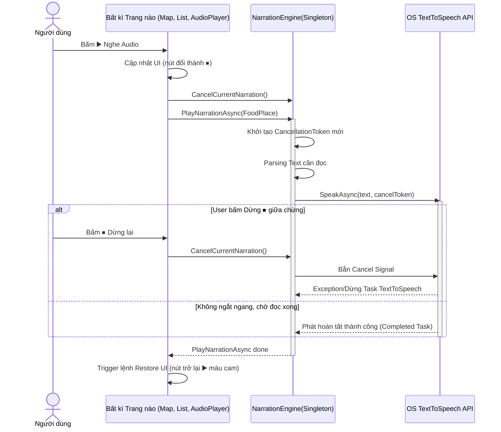

# Sơ đồ UML - Vinh Khanh Food Tour App

Dưới đây là các sơ đồ Use Case, Activity, và Sequence cho các chức năng chính của ứng dụng được trích xuất từ source code, bao gồm cả các chức năng điều hướng chi tiết như Xem Thực Đơn và Chỉ Đường bằng hệ thống Maps ngoài.

## 1. Sơ đồ Use Case Tổng quan

> [!NOTE]
> Sơ đồ này thể hiện các tương tác chính của Người dùng (Tourist) với hệ thống. Đã bổ sung đầy đủ luồng Mở Menu và Chỉ đường.



---

## 2. Các Sơ đồ cho chức năng Xem Chi Tiết Địa Điểm (Mới bổ sung)

### Activity Diagram (Xem Chi Tiết, Gọi Món, Chỉ Đường)



---

## 3. Các Sơ đồ cho chức năng Đăng nhập / Đăng ký

### Activity Diagram (Đăng nhập)



### Sequence Diagram (Đăng nhập)



---

## 4. Các Sơ đồ cho chức năng Xem danh sách địa điểm (Home Page)

### Activity Diagram (Xem & Lọc)



### Sequence Diagram (Load & Lọc Địa Điểm)



---

## 5. Các Sơ đồ cho chức năng Bản đồ & Theo dõi Vị trí (Map Page)

### Activity Diagram (Map & GPS Radar)



### Sequence Diagram (Quét Radar & Tương tác Bản đồ)



---

## 6. Các Sơ đồ cho chức năng Phát Audio Giới Thiệu

### Activity Diagram (Phát Audio bởi NarrationEngine)

```mermaid
flowchart TD
  A([Bắt đầu yêu cầu Nghe Audio]) --> B{Trạng thái Engine hiện tại?}
  B -- Đang phát --> C[Hủy Cancel Narration hiện tại]
  C --> D[Đồng bộ nút UI đang Stop ⏹ về Play ▶️]
  D --> F([Kết thúc])
  B -- Chưa phát --> G[Đồng bộ nút UI từ Play ▶️ thành Stop ⏹]
  G --> H[Đồng bộ UI Map sang nháy vàng (nếu dùng chung Map)]
  H --> I[Gọi NarrationEngine Singleton xử lý]
  I --> J[Trích xuất Text diễn đọc từ đối tượng Model]
  J --> K[Gọi TextToSpeech.Default.SpeakAsync]
  K --> L[Chờ thiết bị TTS đọc xong hoặc có Cancel Token Error]
  L --> M[Restore trạng thái UI Button về ▶️]
  M --> N[Restore UI Map Marker về Bình thường]
  N --> F
```

### Sequence Diagram (NarrationEngine phát Audio)


