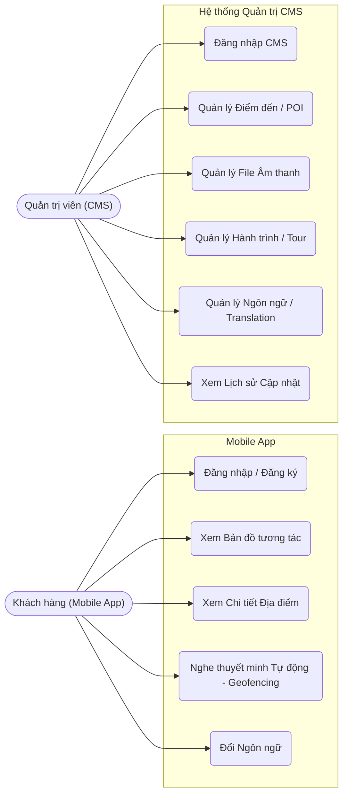
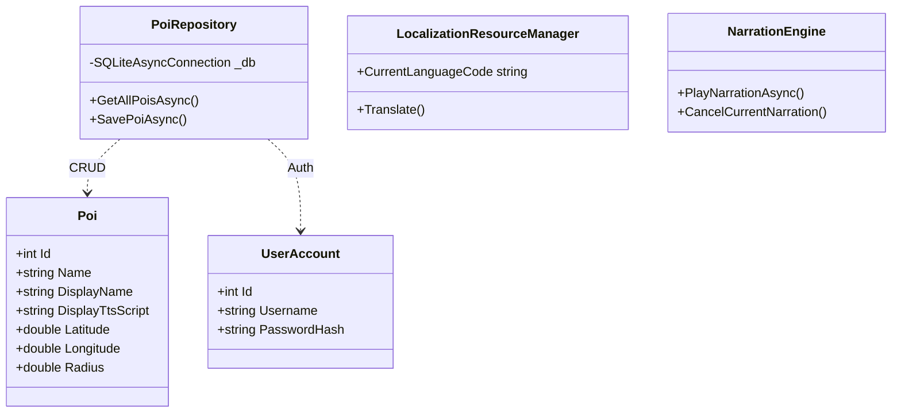
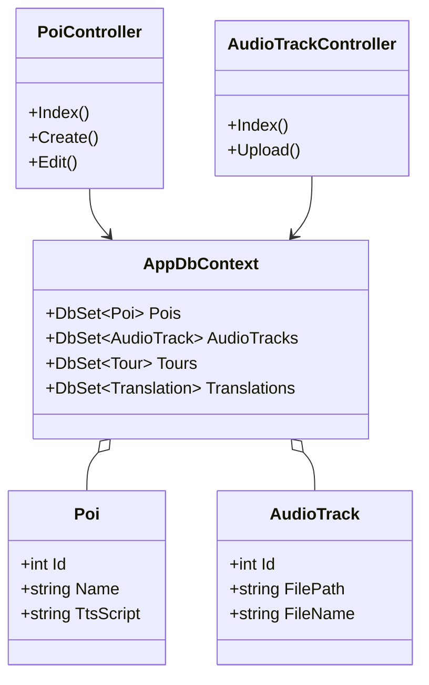
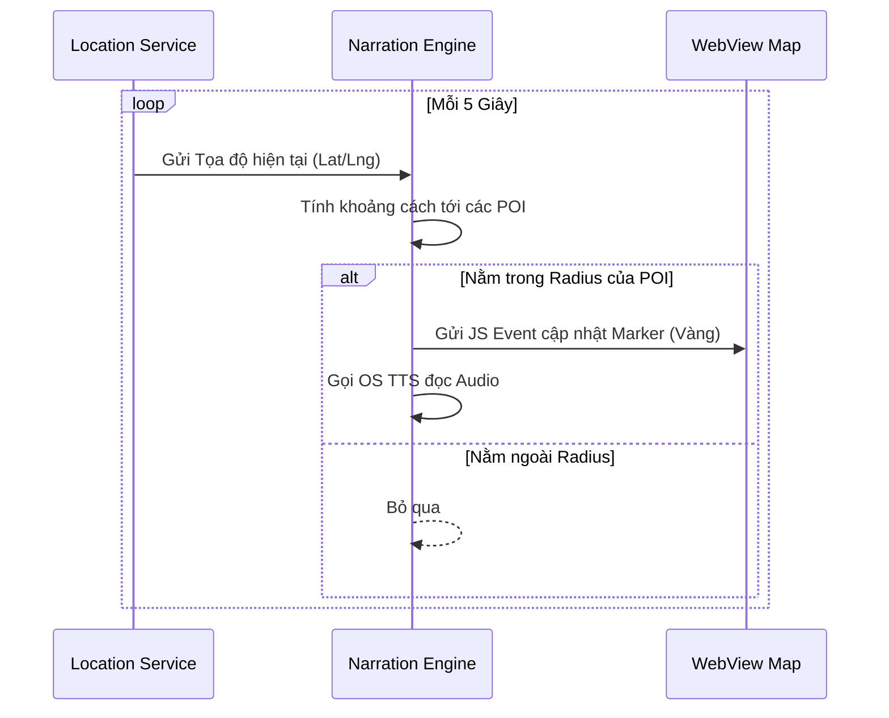
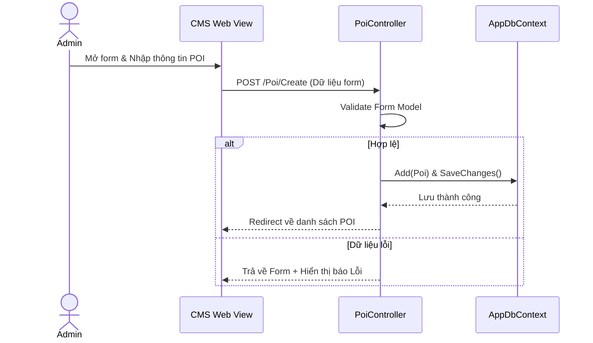
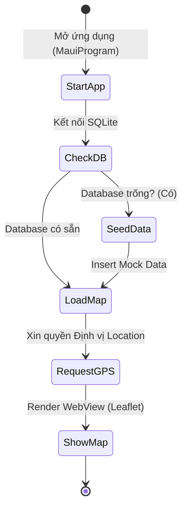
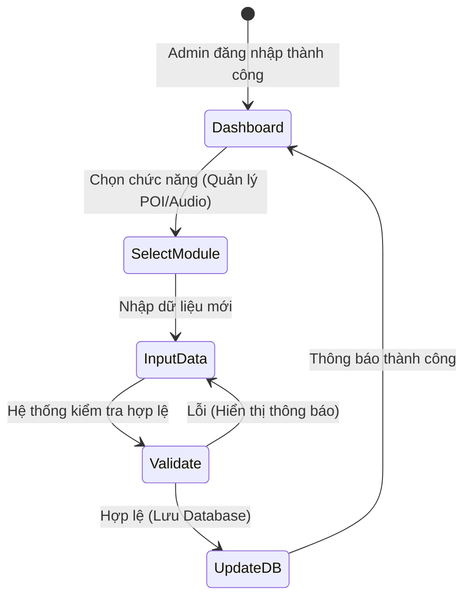

  

  <h2>📍 Hệ Thống Du Lịch Ẩm Thực Phố Vĩnh Khánh Quận 4</h2>
  
<i>Hệ sinh thái bao gồm Hướng dẫn viên ảo đa nền tảng và Hệ thống quản trị nội dung (CMS)</i>

  

    
    
    
    
    
  

## 1. Tổng quan dự án
Dự án **Vinh Khanh Tour** là một giải pháp chuyển đổi số toàn diện nhằm nâng tầm trải nghiệm du lịch tại khu phố ẩm thực Vĩnh Khánh (Quận 4). Dự án bao gồm hai phân hệ (Sub-systems) chính:
1. **Ứng dụng Mobile (VinhKhanhTour)**: Đóng vai trò là "hướng dẫn viên cá nhân" cho du khách. Hỗ trợ hiển thị bản đồ tương tác, tự động phát âm thanh giới thiệu các quán ăn nhờ định vị GPS, và thiết kế Offline-first. 
2. **Hệ thống Quản Trị CMS (VinhKhanhTour.CMS)**: Ứng dụng Web dành cho Ban quản lý hoặc tổ chức du lịch nhằm dễ dàng chỉnh sửa nội dung quán ăn, các điểm du lịch (POIs), Quản lý Tour, Lịch sử truy cập và File hệ thống âm thanh.

## 2. Nền tảng Công nghệ chuyên sâu
Thay vì sử dụng các cấu trúc liền khối truyền thống, dự án lựa chọn các mảnh ghép công nghệ tối ưu hóa theo đặc thù của chức năng: 

- **Đối với Ứng dụng Di động (`VinhKhanhTour`)**: 
  - **Framework Cross-platform**: Sử dụng **.NET MAUI 9.0** (Multi-platform App UI). Với sức mạnh của một codebase C# duy nhất, hệ thống biên dịch trực tiếp sang mã Native của Android, iOS đảm bảo hiệu năng tối ưu. Cấu trúc view được thiết lập qua giao diện tĩnh (HomePage, SettingsPage, PlaceDetailPage) và luồng điều hướng AppShell.
  - **Bản đồ tương tác (Interactive Map)**: Sử dụng **WebView** chứa file HTML tĩnh (local) tích hợp **Leaflet.js** thay cho Map Native. Việc giao tiếp hai chiều thực thi qua `EvaluateJavaScriptAsync` (từ MAUI -> Web) và bắt sự kiện qua URL Scheme (`tappin://id` và `mapclick://clear` từ Web -> MAUI để load Popup).
  - **Cảm biến Định vị & Âm thanh**: MAUI tích hợp `Geolocation` quét ngầm 5 giây/lần. `NarrationEngine.cs` dùng TTS mặc định của hệ điều hành để đọc diễn cảm đoạn Text Description của các quán ăn nếu thỏa mãn vòng Radar.
  - **Cơ sở dữ liệu cục bộ**: Áp dụng **SQLite** (`sqlite-net-pcl`) làm lưu trữ nội bộ. Cung cấp dữ liệu tức thời qua class seed data để duy trì trải nghiệm liền mạch **Offline-First**. 
  
- **Đối với Web Ban quản trị (`VinhKhanhTour.CMS`)**:
  - **Framework Web**: Vận hành bởi **ASP.NET Core 9.0 MVC**. 
  - **ORM (Object-Relational Mapping)**: Tích hợp **Entity Framework Core (EF Core)** vào `AppDbContext`. Sử dụng tính năng Code-First với tính ổn định cao để tạo bảng và quan hệ tự động vào file `VinhKhanhCMS.db`.
  - **Template Giao diện**: Phát triển bằng Razor Views (`.cshtml`), kết hợp Bootstrap 5 cho bố cục màn hình Admin.

## 3. Cấu trúc thư mục (Tóm tắt)
Hệ sinh thái được phân chia theo hai dự án nhằm tách biệt User và hệ thống Admin:
- **Phân hệ `/VinhKhanhTour/` (Mobile MAUI App)**:
    - **Models**: Chứa thực thể ứng dụng (Poi, FoodPlace, FoodItem, UserAccount).
    - **Views**: Đóng gói các màn hình cụ thể (HomePage, MapPage, PlaceDetailPage, SettingsPage, MenuPage, AudioPlayerPage, LoginPage, RegisterPage).
    - **ViewModels**: Tách biệt logic Binding dữ liệu (HomeViewModel).
    - **Services**: Tầng API chức năng (NarrationEngine, LocalizationResourceManager, ModalErrorHandler).
- **Phân hệ `/VinhKhanhTour.CMS/` (Web Dashboard ASP.NET Core MVC)**:
    - Sử dụng mô hình MVC với danh sách **Controllers** đa dạng như `AudioTrackController`, `TourController`, `PoiController`, `TranslationController` điều phối các View quản trị tương ứng thông qua EF Core.

## 4. Chi tiết các Tính năng Cốt lõi
### 📱 Dành cho thiết bị Di Động (Mobile)
- **Hệ thống xác thực (Auth)**: Có màn hình Login / Register cho phép phân biệt Account định danh từ Local DB.
- **Bản đồ tương tác nâng cao**: Nhấp vào Maker các quán ốc, lẩu để popup tên, khoảng cách và nút Tích hợp chỉ đường sang App Google Maps trực tiếp (`MapLaunchOptions`).
- **Hàng Rào Địa Lý (Geofencing Audio)**: Tự động tính toán bằng thuật toán khoảng cách. Nếu người dùng bước vào khu vực Radar, sẽ đổi status báo "PLAYING" trên Map và máy tự động phát loa thoại giới thiệu quán ăn. Nút Control ngay trên màn hình Map cho phép Pause/Resume.
- **Đa ngữ thuật (Localization)**: Thay đổi tiếng việt - tiếng anh (hoạt động qua các Dictionary Local mà không yêu cầu khởi động lại ứng dụng).

### 🌐 Dành cho Quản trị viên (CMS Web)
- **Quản lý Địa Điểm (POI Management)**: Setup tên, tọa độ địa lý chuẩn, kịch bản TTS chi tiết, bán kính Radar kích hoạt âm thanh.
- **Quản lý Thư mục Mở rộng**: Cập nhật hệ thống dữ liệu hành trình (`Tour`), Dữ liệu đa ngôn ngữ nền tảng (`Translation`), kiểm soát lịch sử sử dụng hệ thống (`UsageHistory`), và upload/link các file âm thanh (`AudioTrack`). 

## 5. Luồng Sinh Mệnh Khởi Chạy Mobile
1. Khởi động file `MauiProgram.cs` cấu hình các Depedency / DB.
2. Kiểm tra CSDL, tiêm tập dữ liệu mẫu `GetSampleData()` nếu DB trống (Offline Seeding).
3. Người dùng trỏ qua hệ thống Xác Thực. Truy cập vào `HomePage` hoặc `MapPage`.
4. Khi MapPage được OnNavigatedTo, App yêu cầu quyền Location. -> Nén dữ liệu Pins gửi cho Leaflet.js vẽ bản đồ ở lớp WebView. Xử lý đồng bộ 2 hệ thống.

## 6. Sơ đồ Hệ thống (System Diagrams)

### 6.1 Biểu đồ Use Case (Use Case Diagram)
Thể hiện các chức năng chính của hai đối tượng người dùng: Khách hàng (Sử dụng App Mobile) và Quản trị viên (Sử dụng Web CMS).

### 6.2 Biểu đồ Lớp (Class Diagram)
Thể hiện kiến trúc lưu trữ Data/Service đối với phân hệ Mobile C# và Web CMS.

**Mô hình Lớp Mobile App (Ứng dụng phía Khách hàng):**

**Mô hình Lớp CMS Web (Hệ thống Quản trị):**

### 6.3 Biểu đồ Tuần tự (Sequence Diagram)

**Luồng Phát âm thanh tự động (Geofencing Auto-Audio):**

**Luồng Thêm Địa điểm mới trên CMS (Add POI):**

### 6.4 Biểu đồ Hoạt động (Activity Diagram)

**Luồng Khởi động Mobile App:**

**Luồng Quản lý Nội dung trên CMS:**

---
_Vinh Khanh Tour - Hệ thống O2O kết nối giá trị Ẩm thực tại địa phương thông qua nền tảng Công nghệ hiện đại._